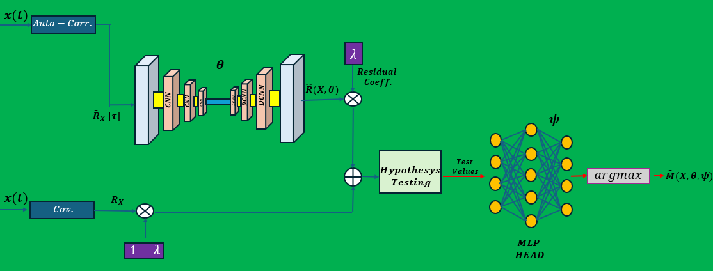

# 📡 Model-Based Deep Learning for Model Order Selection

This repository presents a hybrid model-based deep learning approach for model order selection, developed as part of the Model-Based Deep Learning (MBDL) course project at Ben-Gurion University.

Our approach enhances classical hypothesis testing (e.g., MDL criterion) with learned representations to improve performance in challenging settings such as coherent sources, low SNR, and short observation durations.

---
  
## 📖 Overview

### 🎯 Goal

Accurately estimate the number of signal sources impinging on an array of antennas using both classic statistical methods and deep learning.

### 🔍 Classical Limitation

Methods like MDL and AIC degrade in practical scenarios:

When sources are coherent (e.g., highly correlated)

Under low SNR or few snapshots

### 💡 Our Contribution

We propose a deep-learning-enhanced architecture that:

Computes both the empirical autocorrelation and sample covariance

Maps the autocorrelation through a CNN autoencoder to learn a surrogate covariance

Combines the learned and classic covariances into a hybrid matrix

Passes this to an MDL test followed by an MLP classifier for robust source count prediction

---

## 🖥️ System Architecture

The diagram below illustrates the system pipeline:

### 🧠 Architecture Description

1.**Input Signal**:

  - The raw time-series signal $x(t) \in \mathbb{C}^N$ is collected from a Uniform Linear Array.

2.**Feature Extraction**:

  - Two types of features are computed from the signal:

    - Empirical autocorrelation $\hat{R}_{X}[\tau]$ over lags $\tau = 0, \dots, \tau{\max}$

    - Sample covariance $R_X = \frac{1}{T} \sum_{t=1}^T x(t)x^H(t)$

3.**Surrogate Covariance Learning**:

  - The autocorrelation matrices are passed through a CNN autoencoder to produce a learned covariance estimate $\hat{R}          (X;\theta)$.

4.**Covariance Fusion**:

  - A weighted combination of the learned and raw covariance matrices is computed:

5.**Model Order Estimation**:

  - The fused covariance $\tilde{R}_X$ is processed using the MDL criterion, producing a vector of test values for all           candidate source counts.

6.**Final Prediction**:

  - An MLP classifier is used to interpret the test vector and output the predicted number of active sources.

---

## 📊 Results Overview

We evaluated performance across:

1.**SNR levels** (fixed $T$)

2.**Snapshot counts** (fixed SNR)

3.**Both coherent and non-coherent source scenarios**

Key Findings:

Our MBDL model consistently outperforms classical MDL, especially under coherence

Generalized models trained on a single SNR or $T$ generalize well across varying test conditions

---
## 📚 References

Arad Gast et al., "Near Field Localization via AI-Aided Subspace Methods", 2025.

Julian Merkofer et al., "Deep Augmented MUSIC Algorithm for Data-Driven DoA Estimation", ICASSP 2022.

--- 

## 👥 Contributors

Aviv Ben Ari

Dor Patel

For questions, issues, or access to trained models, feel free to contact us or open an issue. Contributions are welcome! 🚀

